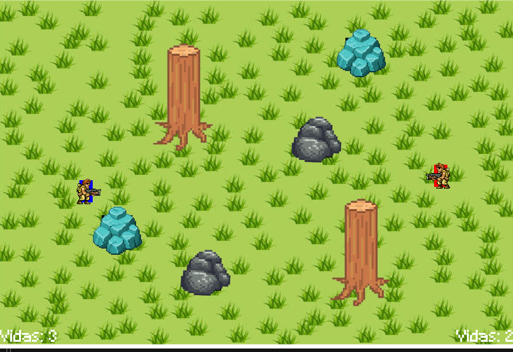

# GotCHA
Gotcha es un juego 1v1 el cual consta de impactar a tu oponente 3 veces para causar su "Game Over"

# Manual del Programador #

## Índice 

1. [Introducción] 
2. [Requisitos del Sistema] 
3. [Configuración del Entorno] 
4. [Estructura del Proyecto] 
5. [Guía de Desarrollo] 
6. [Estándares de Codificación]
8. [Resolución de Problemas] 

## Introduccion

Manual del programador diseñado para especificar las necesidades técnicas y de sistema a aquellos que busquen utilizar y/o modificar el proyecto “Juego Gotcha”.

## Requisitos del Sistema

- **Sistema Operativo**: Windows 10.
- **Programas Necesarios**: Visual Studio Code, MSYS2 (Windows), Github Desktop y Git. 
- **Librerias Utilizadas (MSYS2)**: DevTools, SFML y Box2D simulaciones de fisica - C++.
- **Complementos Necesarios**: Material Icon, C/C++, PlantUML y GitGraph.

## Configuración del Entorno

### Instalación de herramientas necesarias 

1. Descarga e instala las herramientas requeridas: 
- [Visual Studio Code]( https://code.visualstudio.com/)
- [MSYS2 (Windows]( https://github.com/msys2/msys2-installer/releases/download/2023-05-26/msys2-x86_64-20230526.exe):
- No modificar ninguna opción al momento de instalación o podrían variar las configuraciones.
- Una vez instalado es necesario agregar los siguientes directorios al path de windows y reiniciar:
   - C:\msys64\mingw64\bin
   - C:\msys64\usr\bin
- [GitHub Desktop]( https://desktop.github.com/)
- [Git]( https://git-scm.com/)

### Instalación de dependencias en MSYS2

1.	Ejecutar los siguientes comandos en la terminal de MSYS2:
-[DevTools](pacman -S --needed base-devel mingw-w64-x86_64-toolchain)
-[SFML](pacman -S mingw-w64-x86_64-sfml)
-[Box2D simulaciones de fisica - C++](pacman -S mingw-w64-x86_64-box2d)

### Configuracion de VSCode

1. Crear los archivos de configuracion en la carpeta de .vscode:

- [settings.json]: 
{"files.associations": {
    "utility": "cpp"
  },
  "C_Cpp_Runner.cCompilerPath": "gcc",
  "C_Cpp_Runner.cppCompilerPath": "g++",
  "C_Cpp_Runner.debuggerPath": "gdb",
  "C_Cpp_Runner.cStandard": "",
  "C_Cpp_Runner.cppStandard": "",
  "C_Cpp_Runner.msvcBatchPath": "C:/Program Files/Microsoft Visual Studio/VR_NR/Community/VC/Auxiliary/Build/vcvarsall.bat",
  "C_Cpp_Runner.useMsvc": false,
  "C_Cpp_Runner.warnings": [
    "-Wall",
    "-Wextra",
    "-Wpedantic",
    "-Wshadow",
    "-Wformat=2",
    "-Wcast-align",
    "-Wconversion",
    "-Wsign-conversion",
    "-Wnull-dereference"
  ],
  "C_Cpp_Runner.msvcWarnings": [
    "/W4",
    "/permissive-",
    "/w14242",
    "/w14287",
    "/w14296",
    "/w14311",
    "/w14826",
    "/w44062",
    "/w44242",
    "/w14905",
    "/w14906",
    "/w14263",
    "/w44265",
    "/w14928"
  ],
  "C_Cpp_Runner.enableWarnings": true,
  "C_Cpp_Runner.warningsAsError": false,
  "C_Cpp_Runner.compilerArgs": [],
  "C_Cpp_Runner.linkerArgs": [],
  "C_Cpp_Runner.includePaths": [],
  "C_Cpp_Runner.includeSearch": [
    "*",
    "**/*"
  ],
  "C_Cpp_Runner.excludeSearch": [
    "**/build",
    "**/build/**",
    "**/.*",
    "**/.*/**",
    "**/.vscode",
    "**/.vscode/**"
  ],
  "C_Cpp_Runner.useAddressSanitizer": false,
  "C_Cpp_Runner.useUndefinedSanitizer": false,
  "C_Cpp_Runner.useLeakSanitizer": false,
  "C_Cpp_Runner.showCompilationTime": false,
  "C_Cpp_Runner.useLinkTimeOptimization": false,
  "C_Cpp_Runner.msvcSecureNoWarnings": false
}

- [launch.json]:
{"version": "0.2.0",
  "configurations": [
    {
      "name": "C/C++ Runner: Debug Session",
      "type": "cppdbg",
      "request": "launch",
      "args": [],
      "stopAtEntry": false,
      "externalConsole": true,
      "cwd": "c:/Users/danie/Documents/GitHub/juego2/Juego/src",
      "program": "c:/Users/danie/Documents/GitHub/juego2/Juego/src/build/Debug/outDebug",
      "MIMode": "gdb",
      "miDebuggerPath": "gdb",
      "setupCommands": [
        {
          "description": "Enable pretty-printing for gdb",
          "text": "-enable-pretty-printing",
          "ignoreFailures": true
        }
      ]
    }
  ]
}
  
- [c_pp_properties.json]:
{"configurations": [
    {
      "name": "windows-gcc-x64",
      "includePath": [
        "${workspaceFolder}/**"
      ],
      "compilerPath": "C:/msys64/mingw64/bin/gcc.exe",
      "cStandard": "${default}",
      "cppStandard": "${default}",
      "intelliSenseMode": "windows-gcc-x64",
      "compilerArgs": [
        ""
      ]
    }
  ],
  "version": 4
}
  
## Estructura del Proyecto

Juego/
├── .vscode/
├── assets/
│   ├── fonts/
│   └── images/
├── bin/
├── docs/
├── include/
├── src/
├── makefile
└── README.md

- **.vscode/**: Configuración específica del proyecto en VS Code
- **assets/**: Archivos adicionales.
- **fonts/**: Archivos de tipos de fuente para generar texto en el proyecto.
- **images/**: Archivos de imagen usados en el proyecto.
- **bin/**: Archivos generados durante la compilación.
- **docs/**: Archivos de documentacion.
- **include/**: Archivos de encabezado (.hpp).
- **src/**: Archivos fuente principales del proyecto.
- **makefile**: Archivos de compilacion.
- **README. md**: Documentacion en formato Markdown.

## Guia de Desarrollo

1.	Abre el proyecto en Visual Studio Code.
2.	Compila el proyecto
   - Abre el terminal integrado y ejecuta el comando (“g++ -g src/main.cpp -o build/main”)
   - Usa la tarea de compilación (Ctrl+Shift+B).
3.	Ejecuta el programa
   - Usa el terminal integrado y ejecuta el comando (“make runjuego”).

## Estándares de codificación

   - Clases deben estar en PascalCase
   - Instancias definidas en camelCase
   - Respetar estructura de archivos /bin, /docs, /data, /include, /src, etc
   - Documenta el código usando comentarios // o /* */ donde sea necesario.

## Resolución de Problemas

1.	Error: "gcc/g++: command not found"
   - Asegúrate de que el compilador esté instalado y que su ruta esté en el PATH.
2.	IntelliSense no detecta los archivos de encabezado
   - Verifica que la configuración de includePath en c_cpp_properties.json apunte a la carpeta correcta.

# Desarrollo de Videojuego Arcade “Gotcha”

## Descripción del Proyecto

Este proyecto tiene como objetivo principal el desarrollo de un videojuego arcade utilizando el lenguaje de programación C++ y el compilador MinGW. El videojuego contara con características clásicas de los videojuegos arcade en 2D

## Características Principales

- **Plataforma**: El juego será diseñado para ejecutarse en sistemas operativos Windows.
- **Lenguaje de Programación**: C++.
- **Compilador**: MinGW (Minimalist GNU for Windows).
- **Gráficos**: Se utilizará la biblioteca gráfica SFML para la renderización de gráficos 2D.
- **Mecánicas de Juego**: Movimiento del jugador, detección de colisiones y sistema de vidas.
- **Documentación Técnica**: Diagrama de clases en PlantUML para representar la arquitectura del proyecto.

## Tecnologías y Herramientas

- **Lenguaje**: C++.
- **Compilador**: MinGW.
- **Biblioteca Gráfica**: SFML
- **Diseño de Clases**: PlantUML para crear diagramas claros y comprensibles.
- **Editor de Código**: Visual Studio Code o cualquier editor compatible con C++.

## Objetivos Específicos

1. Diseñar la arquitectura del juego mediante un diagrama de clases en PlantUML.
2. Implementar las clases principales del juego, incluyendo:
   - Jugadores
   - Objetos de entorno
   - Sistema de vidas
3. Crear un entorno gráfico interactivo utilizando la biblioteca SFML.
4. Implementar un sistema de control mediante teclado para manejar al jugador.
5. Desarrollar un sistema básico de colisiones y detección de eventos.
6. Integrar un sistema de vidas que registre y muestre el conteo de vidas restantes.

## Diagrama de Clases (PlantUML)

@startuml
Class Juego
Class Tronco
Class Roca
Class Proyectil
Class Personaje{
+Disparar(Proyectil)
}

Juego "1"*--"2" Tronco
Juego "1"*--"4" Roca
Juego "1"*--"2" Personaje
Personaje o-- Proyectil
@enduml

## Resultados Esperados

Al finalizar el proyecto, se espera contar con un videojuego arcade funcional y un diseño estructurado que pueda servir como base para futuras mejoras. Además, el proyecto contará con documentación completa que incluye diagramas de clases y una explicación detallada del código fuente.

## Requisitos Previos

   - Conocimientos básicos de C++.
   - Experiencia con bibliotecas gráficas.
   - Instalación de MinGW y configuración del entorno de desarrollo.
   - Instalación y uso de PlantUML para diagramas.

# Manual de uso: Juego “Gotcha”

## Controles:

   - Flecha Arriba / Tecla “W”: Moverte Arriba
   - Flecha Izquierda / Tecla “A”: Moverte Izquierda
   - Flecha Abajo / Tecla “S”: Moverte Abajo
   - Flecha Derecha / Tecla “D”: Moverte Derecha
   - Tecla “Espacio” / Tecla “Shift”: Disparar

## Objetivo:

Reducir a 0 las vidas del oponente acertando disparos a su personaje antes de que el termine con las tuyas.

## Instrucciones de Uso:

1.	Para inicializar el juego se utiliza el comando “make runjuego” en la terminal.
2.	Una vez que comience el juego ambos jugadores podrán moverse y disparar con sus respectivas teclas:
   - Flechas arriba, izquierda, abajo derecha y tecla “espacio” para jugador 1
   - Teclas “W”, “A”, “S”, “D” y “shift” para jugador 2
3.	El juego termina cuando las vidas de alguno de los dos jugadores han sido consumidas por completo.
